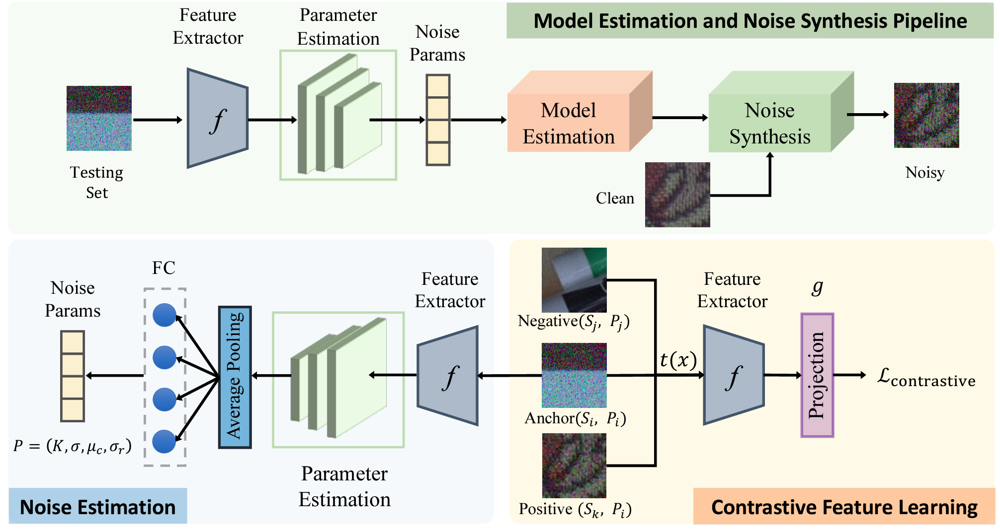

# Deep-Noise-Estimation
 This is the code for [Estimating fine-grained noise model via contrastive learning](https://openaccess.thecvf.com/content/CVPR2022/papers/Zou_Estimating_Fine-Grained_Noise_Model_via_Contrastive_Learning_CVPR_2022_paper.pdf), CVPR 2022, Yunhao Zou, Ying Fu

# Introduction
This work proposes an deep noise model estimation and noise synthesis pipeline for realistic noisy image generation. We learns a noise estimation model with fine-grained statistical noise model in a contrastive manner. Then, the estimated noise parameters are used to synthesize realistic noisy training data. The highlight for our work is that we can estimate cameraspecific noise models for unknown sensors with only testing images, without laborious calibration frames or paired noisy/clean data. The proposed pipeline endows deep denoisers with competitive performances with state-of-the-art real noise modeling methods.



# Steps
To calibrate the camera noise model with only testing data, you would follow the following steps:
1. For each camera type, feed testing noisy raw images to our deep noise estimation model, and you would obtain the noise parameters for each testing image.
2. (optional) If you would like to generate realistic noise across a continuous ISO level, you can calculate the joint distribution based on predicted noise parameters for each camera.
3. Synthesize realistic noise images using either discrete noise parameters (for discrete ISO) or joint distribution (for continuous ISO).
4. Then you can use the synthesized realistic paired data to train you deep model!

# Noise Estimation
Here, we provide an example of our pipeline with SIDD dataset. You can also use other raw datasets, but please make sure the data format are organized as the same as SIDD (including black level, white level, channel order, and other data format)
* Download [**SIDD-Medium Dataset**](https://abdokamel.github.io/sidd/) and put it in folder ```./dataset```
* Run the following script to estimate noise parameters for different camera types
```
python estimate_sidd.py --camera IP # 'S6', 'IP', 'GP', 'N6', 'G4'
```
Then you will obtain the predicted noise parameters and joint distribution in folder ```./sidd_params```

# Noise Synthesis
* With the predicted noise parameters / joint distribution, realistic noise can be synthesized by
```
python noise_synthesis.py --camera IP # ('S6', 'IP', 'GP', 'N6', 'G4')
```
* In this repo, we use the same train/test separation as CA-NoiseGAN, you can find their data at [**CA-NoiseGAN**](https://github.com/arcchang1236/CA-NoiseGAN)
* The synthesized noisy images (after simple ISP for visualization) can be found in ```./sample_result/png/```. You can direct store the raw format output for paired raw denoising training

## Citation
If you find this work useful for your research, please cite: 
```
@inproceedings{zou2022estimating,
  title={Estimating fine-grained noise model via contrastive learning},
  author={Zou, Yunhao and Fu, Ying},
  booktitle={Proceedings of the IEEE/CVF Conference on Computer Vision and Pattern Recognition},
  pages={12682--12691},
  year={2022}
}
```
## Contact
If you have any problems, please feel free to contact me at zouyunhao@bit.edu.cn
## Acknowlegment
The code borrows from [**ELD**](https://github.com/Vandermode/ELD), [**SimCLR**](https://github.com/sthalles/SimCLR), [**CA-NoiseGAN**](https://github.com/arcchang1236/CA-NoiseGAN), and [**Unprocessing**](https://github.com/timothybrooks/unprocessing), please also cite their great work

